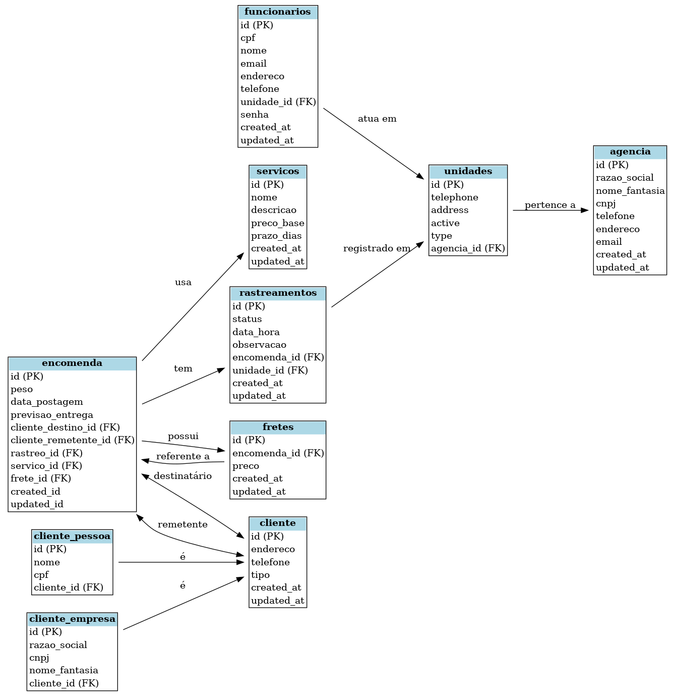

# 📦 API de Entregas — Simulação dos Correios

Este projeto é um backend de API REST que simula o funcionamento de um sistema de entregas semelhante ao dos Correios.  
Ele permite gerenciar agências, unidades, clientes, encomendas, serviços, fretes e rastreamentos.

---

## 🗂 Modelagem e Decisões de Projeto

A modelagem do banco de dados foi desenvolvida para representar fielmente o fluxo de trabalho dos Correios, desde a postagem de um pacote até sua entrega final.

### Estrutura de Entidades e Relacionamentos

- **Agência e Unidades**
  - Cada agência pode ter diversas unidades operacionais.
  - As unidades executam etapas como postagem, triagem e entrega.

- **Funcionários**
  - Associados a uma unidade, responsáveis pelo atendimento e processamento de encomendas.

- **Clientes**
  - Diferencia clientes pessoa física (`cliente_pessoa`) e pessoa jurídica (`cliente_empresa`), mantendo dados centrais na tabela `cliente` para padronização.

- **Encomendas**
  - Contêm peso, data de postagem, previsão de entrega, e estão vinculadas a remetente, destinatário, serviço e frete.

- **Serviços**
  - Representam modalidades de envio (PAC, Sedex etc.) com preço base e prazo.

- **Fretes**
  - Associados a uma encomenda, guardam informações de custo e permitem simular cálculos de envio.

- **Rastreamentos**
  - Registram o histórico de status da encomenda, possibilitando o acompanhamento em tempo real.

---

## 🎯 Como a Modelagem Atende ao Tema

1. **Simulação realista**: Inclui entidades e relacionamentos que refletem o funcionamento dos Correios.
2. **Flexibilidade**: Suporte a múltiplos tipos de clientes e serviços.
3. **Escalabilidade**: Estrutura pronta para integração futura com APIs reais ou novos módulos de rastreamento.
4. **Organização**: Separação lógica entre entidades e relacionamentos para facilitar manutenção e evolução do projeto.

---

## 📌 Diagrama ER

---

## 🚀 Tecnologias Utilizadas

- **Node.js** + **Express** — Backend e rotas
- **PostgreSQL/MySQL** — Banco de dados relacional
- **Sequelize/Prisma** — ORM para manipulação de dados
- **Docker** — Ambiente de desenvolvimento isolado
- **Swagger** — Documentação da API

---
