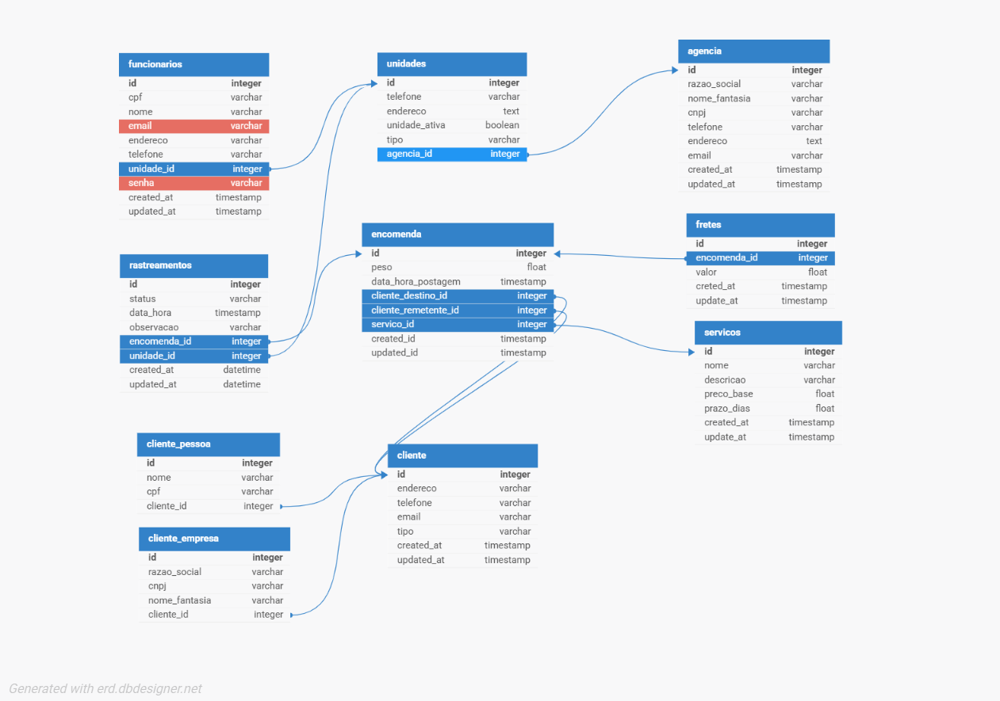

# 📦 API de Entregas — Simulação dos Correios

Este projeto é um backend de API REST desenvolvido em Laravel que simula o funcionamento de um sistema de entregas semelhante ao dos Correios. A aplicação permite gerenciar agências, unidades, clientes, encomendas, serviços, fretes e rastreamentos, fornecendo uma solução completa para operações logísticas.

---

## 📋 Sobre o Projeto

A API foi desenvolvida seguindo boas práticas de desenvolvimento de software, implementando padrões de projeto (Design Patterns) e princípios SOLID para garantir código limpo, manutenível e escalável. A arquitetura do sistema separa responsabilidades entre camadas (Controllers, Services, Repositories), utiliza CQRS para separação de comandos e consultas, implementa o padrão Strategy para cálculos de frete flexíveis e utiliza Factory para criação de objetos cliente.

### Funcionalidades Principais

- **Gestão de Clientes**: Cadastro e gerenciamento de clientes pessoa física e jurídica
- **Gestão de Encomendas**: Criação e acompanhamento de encomendas
- **Cálculo de Fretes**: Sistema flexível com múltiplas estratégias de cálculo
- **Rastreamento**: Acompanhamento em tempo real do status das encomendas
- **Gestão de Agências e Unidades**: Organização hierárquica da estrutura operacional
- **Autenticação**: Sistema de autenticação utilizando Laravel Sanctum

---

## 🗂 Modelagem e Decisões de Projeto

A modelagem do banco de dados foi desenvolvida para representar fielmente o fluxo de trabalho dos Correios, desde a postagem de um pacote até sua entrega final.

### Estrutura de Entidades e Relacionamentos

- **Agência e Unidades**
  - Cada agência pode ter diversas unidades operacionais.
  - As unidades executam etapas como postagem, triagem e entrega.

- **Funcionários**
  - Associados a uma unidade, responsáveis pelo atendimento e processamento de encomendas.

- **Clientes**
  - Diferencia clientes pessoa física (`cliente_pessoa`) e pessoa jurídica (`cliente_empresa`), mantendo dados centrais na tabela `cliente` para padronização.

- **Encomendas**
  - Contêm peso, data de postagem e estão vinculadas a remetente, destinatário, serviço.

- **Serviços**
  - Representam modalidades de envio (PAC, Sedex etc.) com preço base e prazo.
  - Suportam diferentes tipos de cálculo de frete (`tipo_calculo`).

- **Fretes**
  - Associados a uma encomenda, guardam informações de custo e permitem simular cálculos de envio.

- **Rastreamentos**
  - Registram o histórico de status da encomenda, possibilitando o acompanhamento em tempo real.

---

## 🎯 Como a Modelagem Atende ao Tema

1. **Simulação realista**: Inclui entidades e relacionamentos que refletem o funcionamento dos Correios.
2. **Flexibilidade**: Suporte a múltiplos tipos de clientes e serviços.
3. **Escalabilidade**: Estrutura pronta para integração futura com APIs reais ou novos módulos de rastreamento.
4. **Organização**: Separação lógica entre entidades e relacionamentos para facilitar manutenção e evolução do projeto.

---

## 📌 Diagrama ER



---

## 🚀 Tecnologias Utilizadas

- **PHP** + **Laravel** — Backend e rotas
- **MySQL** — Banco de dados relacional
- **Eloquent** — ORM para manipulação de dados
- **Laravel Sanctum** — Autenticação de API

---

## 🏗 Arquitetura e Padrões de Projeto

### Princípios SOLID Aplicados

O projeto aplica os cinco princípios SOLID em diferentes partes do código:

#### 1. Single Responsibility Principle (SRP) - Princípio da Responsabilidade Única

**Localização:**
- **Controllers** (`app/Http/Controllers/`): Responsáveis apenas por receber requisições HTTP e retornar respostas
  - Exemplo: `ClienteController` - gerencia apenas rotas e validações HTTP
  - Exemplo: `RastreamentoController` - coordena comandos e queries de rastreamento
  
- **Services** (`app/Services/`): Contêm a lógica de negócio específica
  - Exemplo: `ClientService` - gerencia operações de negócio relacionadas a clientes
  - Exemplo: `FreteService` - gerencia cálculos de frete
  
- **Repositories** (`app/Repositories/`): Responsáveis exclusivamente pelo acesso a dados
  - Exemplo: `ClientRepository` - encapsula todas as operações de persistência de clientes
  
- **Commands e Queries** (`app/CQRS/`): Separadas por responsabilidade única
  - Commands: `UpdateRastreamentoCommand` e `UpdateRastreamentoHandler` - apenas modificações
  - Queries: `GetAllRastreamentosQuery`, `GetRastreamentoByIdQuery`, etc. - apenas leitura

#### 2. Open/Closed Principle (OCP) - Princípio Aberto/Fechado

**Localização:**
- **Strategy Pattern** (`app/Strategies/FreteCalculator/`): O sistema permite adicionar novas estratégias de cálculo de frete sem modificar código existente
  - `FreteCalculatorInterface` define o contrato
  - Estratégias implementadas: `PorPesoStrategy`, `PorFaixaStrategy`, `PrecoFixoStrategy`, `PorDistanciaStrategy`
  - `FreteCalculatorContext` e `FreteService` funcionam com qualquer implementação da interface, sem necessidade de alteração ao adicionar novas estratégias

**Exemplo:**
```php
// app/Services/FreteService.php
// O código está fechado para modificação, mas aberto para extensão
$strategy = match ($tipoCalculo) {
    'por_peso' => new PorPesoStrategy(),
    'por_faixa' => new PorFaixaStrategy(),
    // Novas estratégias podem ser adicionadas sem alterar este código
};
```

#### 3. Liskov Substitution Principle (LSP) - Princípio da Substituição de Liskov

**Localização:**
- **Strategy Pattern** (`app/Strategies/FreteCalculator/`): Todas as estratégias implementam `FreteCalculatorInterface` e são intercambiáveis
  - Qualquer implementação pode substituir outra sem quebrar o comportamento do `FreteCalculatorContext`
  - Exemplo: `PorPesoStrategy`, `PrecoFixoStrategy`, etc. podem ser usadas indistintamente

#### 4. Interface Segregation Principle (ISP) - Princípio da Segregação de Interface

**Localização:**
- **Contracts** (`app/Contracts/ClientRepositoryInterface.php`): Interface contém apenas os métodos necessários para operações de cliente
  - Métodos específicos: `createClientPessoa`, `createClientEmpresa`, `update`, `find`, `destroy`
  - Não força implementações a incluir métodos desnecessários

#### 5. Dependency Inversion Principle (DIP) - Princípio da Inversão de Dependência

**Localização:**
- **Repository Pattern** (`app/Contracts/ClientRepositoryInterface.php` e `app/Repositories/ClientRepository.php`):
  - `ClientService` depende da abstração `ClientRepositoryInterface`, não da implementação concreta
  - A implementação concreta `ClientRepository` é injetada via Service Provider
  
- **Service Provider** (`app/Providers/RepositoryServiceProvider.php`):
  - Realiza o binding da interface com a implementação concreta usando injeção de dependência do Laravel
  
- **Factory Pattern** (`app/Factories/ClientFactory.php`):
  - `ClientFactory` recebe `ClientRepositoryInterface` no construtor, dependendo da abstração, não da implementação

- **Strategy Pattern**:
  - `FreteCalculatorContext` depende da abstração `FreteCalculatorInterface`, não de implementações concretas
  - `FreteService` utiliza a interface para trabalhar com qualquer estratégia

**Exemplo:**
```php
// app/Factories/ClientFactory.php
public function __construct(ClientRepositoryInterface $repository)
{
    $this->repository = $repository;
}
```

---

### Padrão CQRS (Command Query Responsibility Segregation)

**Localização:** `app/CQRS/`

O padrão CQRS separa as operações de leitura (Queries) das operações de escrita (Commands), proporcionando melhor organização e possibilidade de otimização independente.

#### Commands (Comandos - Modificações)
- **Localização:** `app/CQRS/Commands/Rastreamento/`
  - `UpdateRastreamentoCommand.php`: Objeto que representa o comando de atualização
  - `UpdateRastreamentoHandler.php`: Handler que processa o comando de atualização de rastreamento
  
**Uso:** `RastreamentoController::update()` cria e executa o comando através do handler

#### Queries (Consultas - Leitura)
- **Localização:** `app/CQRS/Queries/Rastreamento/`
  - `GetAllRastreamentosQuery.php`: Query para listar todos os rastreamentos
  - `GetRastreamentoByIdQuery.php`: Query para buscar rastreamento por ID
  - `GetRastreamentosByEncomendaQuery.php`: Query para buscar rastreamentos por encomenda
  - `RastreamentoQueryHandler.php`: Handler que processa todas as queries de rastreamento
  
**Uso:** `RastreamentoController` utiliza as queries através do `RastreamentoQueryHandler` nos métodos `index()`, `show()` e `showRastreamentosRelatedToEncomenda()`

**Benefícios:**
- Separação clara entre leitura e escrita
- Facilita testes unitários
- Permite otimização independente de queries e commands
- Melhora a manutenibilidade do código

---

### Padrão Strategy

**Localização:** `app/Strategies/FreteCalculator/`

O padrão Strategy permite que o algoritmo de cálculo de frete seja selecionado em tempo de execução, baseado no tipo de cálculo configurado no serviço.

#### Componentes:

1. **Interface:** `FreteCalculatorInterface.php`
   - Define o contrato que todas as estratégias devem implementar
   - Método: `calcular(Encomenda $encomenda): float`

2. **Estratégias Concretas:**
   - `PorPesoStrategy.php`: Calcula frete baseado no peso da encomenda
   - `PorFaixaStrategy.php`: Calcula frete baseado em faixas de peso/distância
   - `PrecoFixoStrategy.php`: Retorna um preço fixo do serviço
   - `PorDistanciaStrategy.php`: Calcula frete baseado na distância

3. **Context:** `FreteCalculatorContext.php`
   - Classe que mantém referência à estratégia atual
   - Método `setStrategy()` para definir a estratégia
   - Método `executar()` para executar o cálculo usando a estratégia configurada

4. **Service:** `app/Services/FreteService.php`
   - Utiliza o contexto e seleciona a estratégia apropriada baseada no `tipo_calculo` do serviço
   - Métodos: `calcularFrete()` e `calcularFreteArredondado()`

**Fluxo de Uso:**
1. `FreteService` identifica o `tipo_calculo` do serviço da encomenda
2. Instancia a estratégia correspondente
3. Define a estratégia no contexto
4. Executa o cálculo

**Benefícios:**
- Facilita adicionar novas estratégias de cálculo sem modificar código existente
- Código mais limpo e organizado
- Respeita o princípio Open/Closed

---

### Padrão Factory

**Localização:** `app/Factories/ClientFactory.php`

O padrão Factory encapsula a lógica de criação de objetos cliente, centralizando a decisão de qual tipo de cliente (Pessoa ou Empresa) deve ser criado.

#### Implementação:

**Factory:** `ClientFactory.php`
- Recebe `ClientRepositoryInterface` via injeção de dependência (DIP)
- Método `create(array $data): Cliente`
- Decide qual tipo de cliente criar baseado no campo `tipo` dos dados recebidos
- Delega a criação específica para o repository apropriado

**Uso:**
- `ClientService::createClient()` utiliza a factory para criar clientes
- A factory abstrai a complexidade de criação, permitindo que o service não precise conhecer os detalhes de implementação

**Fluxo:**
1. `ClienteController::store()` recebe requisição
2. `ClientService::createClient()` chama `ClientFactory::create()`
3. Factory identifica o tipo e chama o método apropriado do repository
4. Repository cria o cliente no banco de dados

**Benefícios:**
- Centraliza a lógica de criação
- Facilita adicionar novos tipos de cliente no futuro
- Reduz acoplamento entre service e repository
- Melhora a testabilidade

---

## 📁 Estrutura de Diretórios

```
app/
├── Contracts/              # Interfaces (ISP, DIP)
│   └── ClientRepositoryInterface.php
├── CQRS/                   # Padrão CQRS
│   ├── Commands/
│   │   └── Rastreamento/
│   └── Queries/
│       └── Rastreamento/
├── Factories/              # Padrão Factory
│   └── ClientFactory.php
├── Http/
│   ├── Controllers/        # SRP - Apenas HTTP
│   ├── Middleware/
│   └── Requests/
├── Models/
├── Providers/              # DIP - Injeção de dependência
│   └── RepositoryServiceProvider.php
├── Repositories/           # SRP - Acesso a dados
│   └── ClientRepository.php
├── Services/               # SRP - Lógica de negócio
│   ├── ClientService.php
│   └── FreteService.php
└── Strategies/             # Padrão Strategy (OCP, LSP)
    └── FreteCalculator/
```

---

## 🔧 Configuração e Instalação

### Pré-requisitos

- PHP >= 8.1
- Composer
- MySQL >= 5.7
- Node.js e NPM (para assets)

### Instalação

1. Clone o repositório
2. Instale as dependências:
   ```bash
   composer install
   npm install
   ```
3. Configure o arquivo `.env` com suas credenciais de banco de dados
4. Execute as migrações:
   ```bash
   php artisan migrate
   ```
5. (Opcional) Execute os seeders:
   ```bash
   php artisan db:seed
   ```
6. Inicie o servidor:
   ```bash
   php artisan serve
   ```

---

## 📝 API Endpoints

A documentação completa da API pode ser encontrada através das rotas definidas em `routes/api.php`.

Principais endpoints:
- `/api/clientes` - CRUD de clientes
- `/api/encomendas` - CRUD de encomendas
- `/api/fretes` - Cálculo e gestão de fretes
- `/api/rastreamentos` - Consulta e atualização de rastreamentos
- `/api/auth` - Autenticação

---

## 🧪 Testes

O projeto inclui testes unitários e de integração. Execute com:

```bash
php artisan test
```

---

## 📄 Licença

Este projeto foi desenvolvido para fins educacionais.

---

## 👥 Contribuição

Este é um projeto acadêmico desenvolvido para demonstrar a aplicação de princípios SOLID e padrões de projeto em uma API Laravel.
